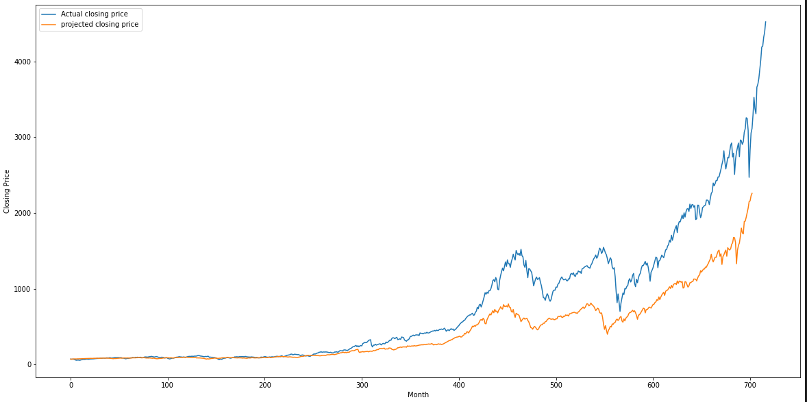
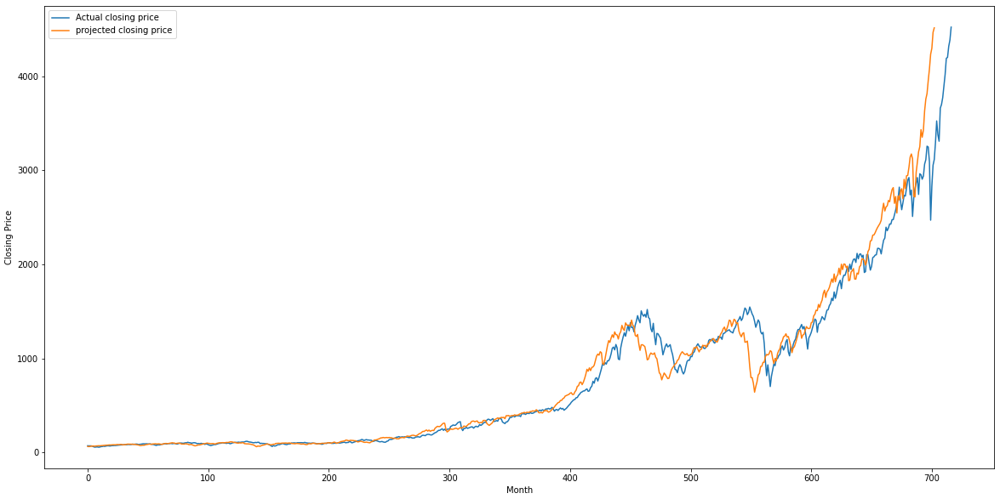

# ECS 171 SQ 2022 Final Project

#### The goal of this project is to predict the next market crash using a S\&P 500 data-set that has the details about the daily price from 1927-12-30 to 2021-09-19. This project would be beneficial to any heavy investors who are susceptible to major losses as it allows them to know ahead of time when the market crash would be, and also would provide major upside for an investor who is willing to invest heavily during the market crash prediction date of our project returns. 

#### We are using Keras' ANN model to conduct time series analysis on the SNP 500 stock market and try to predict the closing price of the stock.

# 

# Project Organization

- `README.md` - This file. 
- `./docs` - The directory containg the HTML and figures for the website.
- `./NN_condensed_multivariate_model` - The directory containing the saved multivariate time series model trained with the condensed data set. 
- `./NN_condensed_univariate_model` - The directory containing the saved univariate time series model trained with the condensed data set. 
- `./NN_FULL__MULTIVARIATE_model` - The directory containing the saved multivariate time series model trained with the full data set. 
- `./NN_FULL__UNIVARIATE_model` - The directory containing the saved univariate time series model trained with the full data set. 
- `./NN_model` - The directory containing special models that are used in the interactive models.
- `./project_proposal` - Latex files and pdf for the project proposal.
- `./project_report` - Latex files and pdf for the project report, as well as all the suporting figures.
- `data_visual.ipynb` - Notebook for producing charts and graphs as data visualizations.
- `NN_big.ipynb` - Notebook containing the implementations for the time series models trained with the full data sets. 
- `NN_Interactive.ipynb` - Cesar
- `NN.ipynb` - Notebook containing the implementations for the time series models trained with the condensed data sets. 
- `PlotsForDatAnalysis.ipynb` - Nate
- `poly_lin_regression.ipynb` - Notebook for producing data analysis charts (heatmap, pairplot) and linear/polynomial regression models.
- `SP500_PE-EPS_and_Closing.csv` - CSV file containing the monthly recording of the SNP closing price, P/E ratio, EPS, and product of P/E ration and EPS.
- `SP500.csv` - CSV file containing the monthly recording of the SNP stock market with various attributes. This is the condensed data set.
- `SPX_500_Data.csv` - CSV file containing the daily recordings of the SNP stock market with different attributes. This is the full data set. 

# Libraries used
 - Flask
 - WTForms
 - keras
 - numpy
 - pandas
 - sklearn
 - matplotlib
 - tensorflow

# Instructions
## Time series models
The jupyter notebooks, `NN.ipynb` and `NN_big.ipynb`, contains the time series models' implementations. The differences between them are minimal. `NN.ipynb` will read the condensed data set and have the correct data processing procedures. 
The two notebooks follow a similar work flow:
1. Import libraries
2. Data preprocessing 
    - Import csv file
    - Definitions for hyperparamaters
    - Standardarizing the data frame
    - Training/test split
    - Create testing/training data for time series model
3. NN model creation and training
4. *Saving/loading model(optional)*
5. Creating the testing data frame, for testing partial or entire time frame.
6. Plotting the results
7. Model performance calculation.

*Note: please comment out `model.save` in block 68 to prevent overriding the saved trained models in the repo.*

Some of the variable naming style used in the notebooks are as follows:
- `X_test` - testing data frame for univariate model, contains $20\%$ of the input data set. 

- `X_test_mul` - testing data frame for multivariate model, contains $20\%$ of the input data set.

- `X_test_full` - testing data frame for univartiate model, contains the entire input data set.

- `X_test__mul_full` - testing data frame for multivartiate model, contains the entire input data set.

## Interactive model
To use the interactive model, after installing the necessary libraries go into the "interactiveDemo" directory. Once inside run "python3 app.py" in the command line. Ensure that you are running python 3.7+ and all specified libraries are downloaded. Once finished compiling, it sets up the interactive demo website on your local machine. The link to it is printed on the terminal, copy and paste this to your chrome browser and you are now free to use the interactive website.

## Our Progress
Here is an additional website showcasing our progress: https://nfax117.github.io/ECS171_Proj1/
# Group Members

- Sergio Santoyo
- Yuan Chang
- Cesar Guzman Avina
- Will Colbert
- Nathaniel Faxon
- Kanchan Kaur
- Parminder Singh

Last updated on May 31st, 2022
